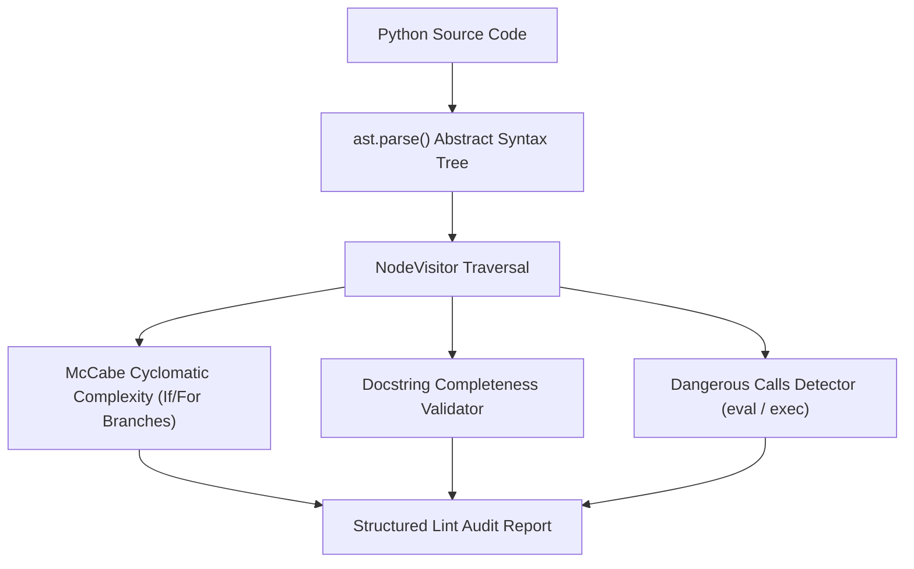

# genpark-ast-static-code-analyzer-linter-skill

Agent Skill implementing **Python AST Static Analysis, Complexity Calculation & Security Linting** in 100% Python standard library.

## Architectural Flow

